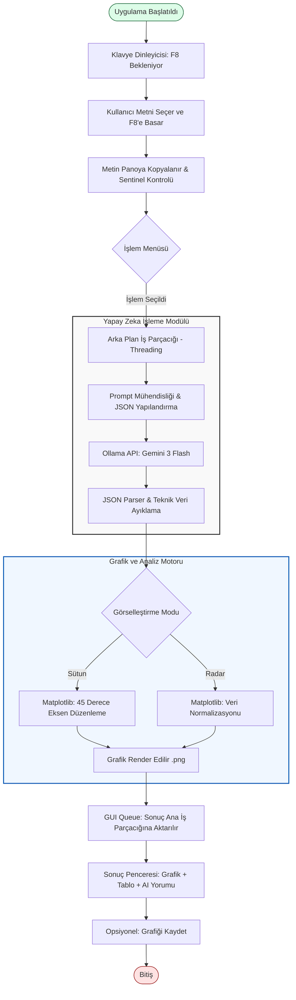

# AI-Powered Semantic Data Visualizer

Bu proje, metin yığınlarını analiz ederek içerisindeki teknik verileri cımbızla çeken ve bu verileri profesyonel grafiklere (Sütun ve Radar) dönüştüren yapay zeka destekli bir asistandır. 

## 🚀 Öne Çıkan Özellikler

* **Anlamsal Veri Çıkarımı:** Gemini 3 Flash modelini kullanarak metinde sayı olmasa bile ürünleri tanır ve teknik verilerini hafızasından çağırır.
* **Asenkron Mimari (Threading & Queue):** Yapay zeka ve grafik oluşturma işlemleri arka planda çalışır, arayüz asla donmaz.
* **Akıllı Görselleştirme:**
    * **Normalizasyon:** Radar grafiklerinde farklı birimlerin (beygir, bagaj hacmi vb.) birbirini ezmesini engeller.
    * **Otomatik Eksen Düzenleme:** Sütun grafiklerinde yazıların çakışmasını önlemek için 45 derece eğim kullanır.
* **Global Erişim:** F8 kısayolu ile herhangi bir uygulama üzerinden (tarayıcı, PDF, not defteri) seçili metni saniyeler içinde işler.
* **Kaydetme Özelliği:** Oluşturulan grafikleri PNG formatında yüksek çözünürlüklü olarak kaydedebilir.

## 🛠️ Teknik Detaylar

* **Dil:** Python
* **Model:** Gemini 3 Flash (Ollama API üzerinden)
* **Arayüz:** Tkinter (Koyu tema entegrasyonu)
* **Grafik Kütüphanesi:** Matplotlib
* **Görüntü İşleme:** Pillow (PIL)

## 📦 Kurulum ve Kullanım

1.  **Ollama Kurulumu:** Bilgisayarınızda [Ollama](https://ollama.com/) kurulu olmalı ve `gemini-3-flash-preview` modeli aktif olmalıdır.
2.  **Kütüphanelerin Kurulması:**
    ```bash
    pip install pyperclip pynput pyautogui matplotlib requests pillow
    ```
3.  **Çalıştırma:** `BASLAT.bat` dosyasına tıklayın veya terminalden `pythonw main.pyw` komutunu çalıştırın.
4.  **Kullanım:** Herhangi bir metni seçin ve **F8** tuşuna basın. Açılan menüden istediğiniz analiz türünü seçin.

## 👨‍💻 Mühendislik Yaklaşımı

Bu proje, bir yazılım mühendisliği öğrencisi tarafından; veri madenciliği, doğal dil işleme (NLP) ve GUI tasarımı disiplinlerini birleştirmek amacıyla geliştirilmiştir. Özellikle veri setleri arasındaki uçurumları kapatmak için kullanılan normalizasyon algoritmaları ve çoklu iş parçacığı (multithreading) yönetimi projenin teknik temelini oluşturur.


